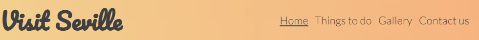
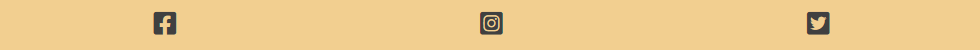
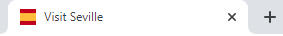
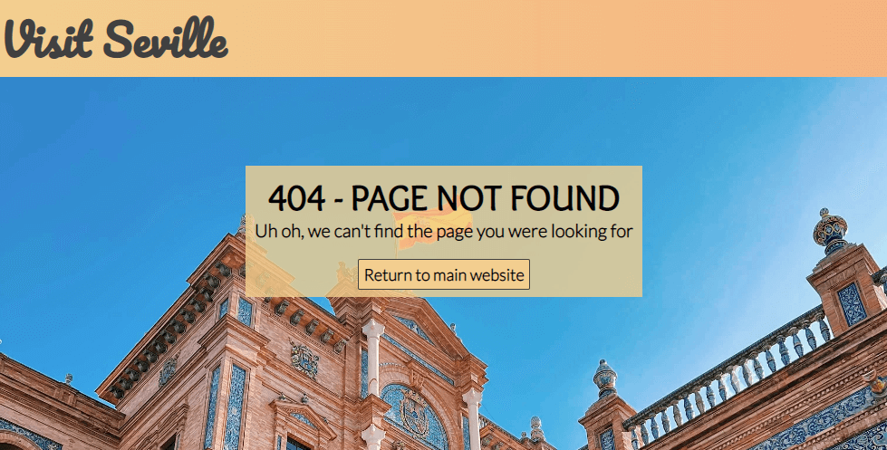

# Visit Seville
Visit Seville is a tourist information website for people interested in visiting Seville, Spain. It includes a number of recommendations for the key attractions to explore as well as some advice on the best times of year to visit.

[View the live site here](https://s-batish.github.io/visit-seville/index.html)

## User Experience
### Key information included on the site
- A brief overview of the city's highlights
- Images and key facts about each attraction
- Information about when to visit the city
- A contact us form to sign up to a monthly newsletter about Seville and to ask any further questions
### Site Owner's goals
- To provide a comprehensive and informative guide about the main tourist attractions in Seville
- To provide a brief overview of the best times of year to visit the city so that visitors can be prepared for what to expect
- To show the beauty of the city through a number of photographs of Seville
- To enable people to sign up for a monthly newsletter for more relevant and regularly updated information about the city
- To provide a space for people to ask further questions that may not have been answered through the site
### External User's goals
- I want to easily find out about the key sites to visit in Seville and to know when is best to visit based on price and climate
- I want to see what the main features of the city look like
- I want to easily contact someone to ask further questions and to be regularly updated about events in the city
## Design
### Wireframes
Balsamiq wireframes were created for mobile, tablet and desktop devices to show the structure and overall design of each page.

[Home page wireframe](docs/home-wireframe.png)

[Things to do wireframe](docs/things-to-do-wireframe.png)

[When to visit wireframe](docs/when-to-visit-wireframe.png)
- Initially the 'When to visit' section of information was intended to be laid out on a separate page, which can be seen in the wireframe above. However, after a discussion with my mentor, it was decided that it looked better, and made more sense, to have this section of information on the homepage underneath the 'About Seville section' instead.

[Gallery wireframe](docs/gallery-wireframe.png)

[Contact us wireframe](docs/contact-wireframe.png)

### Colour scheme

[Adobe Color](https://color.adobe.com/create/color-wheel) was used to create the colour palette for the website.
### Typography
The following [Google Fonts](https://fonts.google.com/) were used for the typography for the website:
- Pacifico is used for the h1 logo
- Overlock is used for the h2 headings
- Lato is used for the h3 headings
- Hind Siliguri is used for the body text
## Features
The website is made up of six pages, four of which are accessible from the navigation menu (Home page, Things to do page, Gallery page, and Contact us page). The other two pages are a Thank you page, which is displayed once the user submits the form on the Contact us page, and a 404 page, which is displayed if a user tries to reach a non-existent page on the website.
### Common features
- Navigation bar
    - The navigation bar features at the top of each of the four main pages of the website, and it is sticky to ensure that it is always visible even when scrolling down the page.
    - It contains links to the Home, Things to do, Gallery and Contact us pages. The logo itself is also a link to the Home page.
    - The navigation bar is responsive on all devices. For mobiles and small devices, the navigation bar items are stacked in a column. But as the screen size increases, the menu items display horizontally and their font size, as well as the logo size, increase at various intervals, through the use of media queries.
    - A horizontal line displays underneath the active page that the user is on so that they can clearly see which page they are currently on. The horizontal line will also display underneath each menu item when the user hovers over it.

- Footer
    - The footer appears at the bottom of each of the four main pages and contains icons as links to social media websites that will open in a new tab. Aria labels have been used on the social media icons to ensure the footer is accessible to the visually impaired.

- Favicon
    - A favicon icon of the Spanish flag will display on every page of the website to make the website easily identifiable in the tabs header.

- 404 page
    - The 404 page has been implemented to display if a user is misdirected to a broken link. It has a 'Return to main website button' to direct the user to the home page without the need to click the back button on their browser.

### Home page features
### Things to do page features
### Gallery page features
### Contact us page features
### Features left to implement 
## Technologies
## Testing
## Deployment
## Credits