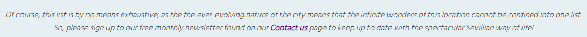

# Visit Seville
Visit Seville is a tourist information website for people interested in visiting Seville, Spain. It includes a number of recommendations for the key attractions to explore as well as some advice on the best times of year to visit.

[View the live site here](https://s-batish.github.io/visit-seville/index.html)

## User Experience
### Key information included on the site
- A brief overview of the city's highlights
- Images and key facts about each attraction
- Information about when to visit the city
- A contact us form to sign up to a monthly newsletter about Seville and to ask any further questions
### Site Owner's goals
- To provide a comprehensive and informative guide about the main tourist attractions in Seville
- To provide a brief overview of the best times of year to visit the city so that visitors can be prepared for what to expect
- To show the beauty of the city through a number of photographs of Seville
- To enable people to sign up for a monthly newsletter for more relevant and regularly updated information about the city
- To provide a space for people to ask further questions that may not have been answered through the site
### External User's goals
- I want to easily find out about the key sites to visit in Seville and to know when is best to visit based on price and climate
- I want to see what the main features of the city look like
- I want to easily contact someone to ask further questions and to be regularly updated about events in the city
## Design
### Wireframes
Balsamiq wireframes were created for mobile, tablet and desktop devices to show the structure and overall design of each page.

[Home page wireframe](docs/wireframes/home-wireframe.png)

[Things to do wireframe](docs/wireframes/things-to-do-wireframe.png)

[When to visit wireframe](docs/wireframes/when-to-visit-wireframe.png)
- Initially the 'When to visit' section of information was intended to be laid out on a separate page, which can be seen in the wireframe above. However, after a discussion with my mentor, it was decided that it looked better, and made more sense, to have this section of information on the homepage underneath the 'About Seville section' instead.

[Gallery wireframe](docs/wireframes/gallery-wireframe.png)

[Contact us wireframe](docs/wireframes/contact-wireframe.png)

There are no wireframes for the Thank you and 404 pages as these pages were implemented after work on the project had already begun, and they use the same background and style as the Contact us page.

### Colour scheme

[Adobe Color](https://color.adobe.com/create/color-wheel) was used to create the colour palette for the website.
### Typography
The following [Google Fonts](https://fonts.google.com/) were used for the typography for the website:
- Pacifico is used for the h1 logo
- Overlock is used for the h2 headings
- Lato is used for the h3 headings
- Hind Siliguri is used for the body text
## Features
The website is made up of six pages, four of which are accessible from the navigation menu (Home page, Things to do page, Gallery page, and Contact us page). The other two pages are a Thank you page, which is displayed once the user submits the form on the Contact us page, and a 404 page, which is displayed if a user tries to reach a non-existent page on the website.
### Common features
- Navigation bar
    - The navigation bar features at the top of each of the four main pages of the website, and it is sticky to ensure that it is always visible even when scrolling down the page.
    - It contains links to the Home, Things to do, Gallery and Contact us pages. The logo itself is also a link to the Home page.
    - The navigation bar is responsive on all devices. For mobiles and small devices, the navigation bar items are stacked in a column. But as the screen size increases, the menu items display horizontally and their font size, as well as the logo size, increase at various intervals, through the use of media queries.
    - A horizontal line displays underneath the active page that the user is on so that they can clearly see which page they are currently on. The horizontal line will also display underneath each menu item when the user hovers over it.

- Footer
    - The footer appears at the bottom of each of the four main pages and contains icons as links to social media websites that will open in a new tab. Aria labels have been used on the social media icons to ensure the footer is accessible to the visually impaired.

- Favicon
    - A favicon icon of the Spanish flag will display on every page of the website to make the website easily identifiable in the browser tab's header.

- 404 page
    - The 404 page has been implemented to display if a user is misdirected to a broken link. It has a 'Return to main website button' to direct the user to the home page without the need to click the back button on their browser.

### Home page features
- Hero image
    - This is a picture of one of Seville's main attractions (the Plaza de España) with cover text statement to entice users to explore the site further.
    - The image zooms in when the user clicks on the logo/Home link on the nav bar, and it was chosen to be the hero image because it is one of the most popular landmarks in Seville, so is instantly recognisable for those who may know a little about the city, and for those who know nothing about the city, it is an eye catching structure that is made more appealing through the zoom feature. Moreover, it stretches nicely across the screen on large screen sizes, while also resizing on smaller devices to ensure that it always grabs the attention of the user.
    - The cover text also increases as the screen size increases so that it is proportioned well against the image.

- About Seville section
    - This section provides a brief introduction to Seville by mentioning some of the key features of the city, which have been highlighted in bold to draw the user's attention to these aspects.
    - This section lets the user know what to expect, at a glance, from a visit to Seville.

- When to visit section
    - This section features underneath the About Seville section and is separated from that section with an image of a typical Sevillian street that is in keeping with the colour scheme.
    - This section provides clear information to the user about the best time of year to visit the city, and it is divided into smaller sections to make it easier for users to identify the best time to visit based on their needs.
    - Below this, there is a link directly to the Contact us form to make it easier for users to enquire further about when to visit.

### Things to do page features
- Things to do
    - This page provides the user with eight recommendations for things to see and do in Seville.
    - Each attraction is displayed with what it is, a photo of it, and some information below detailing why it should be visited.
    - This section is fully responsive. On small and medium sized devices the recommendations are displayed in a single column on top of each other, so that the images are clear and the screen does not look congested with information. On large to extra large devices the content is displayed in two columns and on larger than extra large devices the content is displayed in three columns. This is to ensure that the recommendations are presentable and easily digestible for the user.

Below all of the recommendations, there is a link directly to the Contact us form for users who wish to find out more in a monthly newsletter about the city.

### Gallery page features
- Gallery page
    - This page provides a fully responsive insight into the key features of Seville through photos. This gives the user a snapshot of what is to be expected upon visiting the city.
    - Media queries have been used to change the size of the photos and the number of columns that they will appear in. This is to ensure that the photos are always clear for the user no matter what screen size they are viewing them on.

### Contact us page features
- Sign up form
    - This form enables users to contact the Visit Seville team to request a free monthly newsletter about the city and/or to ask any specific questions that they still have.
    - The form includes the following fields and attributes:
        - Name (required, type=text)
        - Email (required, type=email)
        - Would you like to sign up to our monthly newsletter? Yes/No (required, type=radio)
        - Let us know if you have any specific questions below. We're always happy to help! (type=textarea)

- Thank you page
    - If the user successfully fills out the form, they will be taken to a Thank you page once they press the submit button. This page will include a 'Return to home page' button so that the user can continue browsing the website.

### Features left to implement
- The Contact us form will be updated with the technologies required to send the contact details, sign up option and questions to a database so that the user will be able to receive their newsletter and/or have their questions answered.
- Each gallery image could be clicked on to expand with a small description of what each photo is.
## Technologies
- HTML
    - The main language used throughout the website to create the structure
- CSS
    - Used to implement styling across the website
- Gitpod
    - Used to develop and edit the code
- Git
    - Used to commit and push the code
- Github
    - Used to store and deploy the code
- [Balsamiq](https://balsamiq.com/)
    - Used to create wireframes
- [Google Fonts](https://fonts.google.com/)
    - Used to import fonts
- [Font Awesome](https://fontawesome.com/icons)
    - Used icons from this website as the social media links
- [Fontjoy](https://fontjoy.com/)
    - Used to create the font pairings used on the website
- [TinyPNG](https://tinypng.com/)
    - Used to reduce the size of the images used throughout the website
- [Favicon](https://favicon.io/)
    - Used to create a favicon

## Testing
### Responsiveness

- The website has been tested on Chrome, Edge and Firefox as well as on an iPhone 11, iPhone 13 mini, Samsung ..., and iPad ... in order to check the responsiveness on different devices and different browsers.
- The responsiveness of the site has also been tested using developer tools by adjusting the size of the screen and checking that all the content remains legible and clearly formatted, and that all pictures are clear and unpixelated.

### Accessibility
- [Wave](https://wave.webaim.org/) accessibility tool was used to check how accessible the entire website is. No accessibility errors were found on any of the pages and these results can be viewed below:
    - [Home page](docs/testing/home-wave.png)
    - [Things to do page](docs/testing/things-to-do-wave.png)
    - [Gallery page](docs/testing/gallery-wave.png)
    - [Contact us page](docs/testing/contact-wave.png)
    - [Thank you page](docs/testing/thank-you-wave.png)
    - [404 page](docs/testing/404-wave.png)

- Aria-labels have been used on the social media icons to state what those links do and that they will open in a new tab. An aria-label has also been used on the link that says 'here' on the 'Things to do' page to explain where this link will take the user.
- On all of the image elements, the alt attribute has been used to describe each of the images.
- Heading levels have been used in the correct order, with none being skipped, to ensure that the user can easily see the importance of the content. 
### Validator testing
- HTML
    - No errors were found when passed through the official [W3C validator](https://validator.w3.org/). The results can be found below:
        - [Home page](docs/testing/home-validator.png)
        - [Things to do page](docs/testing/things-to-do-validator.png)
        - [Gallery page](docs/testing/gallery-validator.png)
        - [Contact us page](docs/testing/contact-validator.png)
        - [Thank you page](docs/testing/thank-you-validator.png)
        - [404 page](docs/testing/404-validator.png)
- CSS
    - No errors were found when passed through the official [Jigsaw validator](https://jigsaw.w3.org/css-validator/). The results can be found below:
        - [CSS](docs/testing/css-validator.png)
### Lighthouse testing
### Manual testing
Thorough testing of the site has been undertaken to ensure that it runs as expected and that all links and features are working exactly as they should be.
- Navigation and footer links
    - These links were tested on each of the four main pages of the website and the results can be seen below:

| Feature | Expect | Action | Result |
| ---| ---| ---| ---|
| Logo| When clicked, the user is taken to the 'Home' page| Clicked the logo| Taken to the 'Home' page|
|Home link|The text underlines when hovering over it. When clicked, the user is taken to the 'Home' page. The text remains underlined when on the 'Home' page.|Hovered over the text. Clicked the 'Home' link.|The text underlines when hovered over. Taken to the 'Home' page when clicked. Text remains underlined when on the 'Home' page.|
|Things to do link|The text underlines when hovering over it. When clicked, the user is taken to the 'Things to do' page. The text remains underlined when on the 'Things to do' page.|Hovered over the text. Clicked the 'Things to do' link|The text underlines when hovered over. Taken to the 'Things to do' page when clicked. Text remains underlined when on the 'Things to do' page.|
|Gallery link|The text underlines when hovering over it. When clicked, the user is taken to the 'Gallery' page. The text remains underlined when on the 'Gallery' page.|Hovered over the text. Clicked the 'Gallery' link|The text underlines when hovered over. Taken to the 'Gallery' page when clicked. Text remains underlined when on the 'Gallery' page.|
| Facebook icon| When clicked, the user is taken to Facebook website in a new tab| Clicked the icon| Taken to the Facebook website in a new tab.|
| Instagram icon| When clicked, the user is taken to Instagram website in a new tab| Clicked the icon| Taken to the Instagram website in a new tab.|
| Twitter icon| When clicked, the user is taken to Twitter website in a new tab| Clicked the icon.| Taken to the Twitter website in a new tab.|

- 'Home' page

| Feature | Expect | Action | Result |
| ---| ---| ---| ---|
| 'Contact us' link| When clicked, the user is taken to the 'Contact us' page.| Clicked the link| Taken to the 'Contact us' page.|

- 'Things to do' page

| Feature | Expect | Action | Result |
| ---| ---| ---| ---|
| 'here' link| When clicked, the user is taken to the 'Contact us' page.| Clicked the link.| Taken to the 'Contact us' page.|

- 'Contact us' page

| Feature | Expect | Action | Result |
| ---| ---| ---| ---|
| Fill out the form correctly| After pressing 'submit' the user is taken to the 'Thank you' page.| Filled out the form with a name, valid email address and selected the 'yes' radio button. Then pressed 'submit'.| Taken to the 'Thank you' page.|
| Fill out the form with no name| After pressing 'submit', the form does not submit. The user is presented with an error message to fill out the field.| Filled out the form without a name, but with a valid email address and selected the 'yes' radio button. Then pressed 'submit'.| Form does not submit and error message displayed.|
| Fill out the form with no email| After pressing 'submit', the form does not submit. The user is presented with an error message to fill out the field.| Filled out the form without email, but with a name and selected the 'yes' radio button. Then pressed 'submit'| Form does not submit and error message displayed.|
| Fill out the form with incorrect email format| After pressing 'submit', the form does not submit. The user is presented with an error message to input a valid email address correctly.| Filled out the form with incorrect email format, but with a name and selected the 'yes' radio button. Then pressed 'submit'.| Form does not submit and error message displayed.|
| Fill out the form without checking a radio button| After pressing 'submit', the form does not submit. The user is presented with an error message to select one of the options.| Filled out the form with a name and valid email address, but without selecting one of the radio buttons. Then pressed 'submit'.| Form does not submit and error message displayed.|
| Fill out the form correctly and with a message longer than the size of the textarea box| The size of the box does not increase, but has allows the user to scroll down. After pressing 'submit' the user is taken to the 'Thank you' page.| Filled out the form with a name, valid email address, selected the 'yes' radio button and wrote a message longer than the size of the textarea box. Then pressed 'submit'.| The size of the box does not increase, but has allows the user to scroll down. After pressing 'submit', taken to the 'Thank you' page.|

- 'Thank you' page

| Feature | Expect | Action | Result |
| ---| ---| ---| ---|
| Logo| When clicked, the user is taken to the 'Home' page.| Clicked the logo.| Taken to the 'Home' page.|
| 'Return to home page' link| The button and text colours change when hovering over it. When clicked, the user is taken to the 'Home' page.| Clicked the link.| The button and text colours changed when hovering over it. Taken to the 'Home' page when clicked.|

- '404' page

| Feature | Expect | Action | Result |
| ---| ---| ---| ---|
| Logo| When clicked, the user is taken to the 'Home' page.| Clicked the logo.| Taken to the 'Home' page.|
| 'Return to home page' link| The button and text colours change when hovering over it. When clicked, the user is taken to the 'Home' page.| Clicked the link.| The button and text colours changed when hovering over it. Taken to the 'Home' page when clicked.|

### Testing user stories
- Expectation: I want to easily find out about the key sites to visit in Seville and to know when is best to visit based on price and climate.
    - Result: The site is easy to navigate, thanks to the navigation menu at the top of every page, so it is easy to find a list of things to do, and there is detailed information on the home page explaining when the best time to visit is, which is divided into sections to make it clear when it will be cheaper or better weather.
- Expectation: I want to see what the main features of the city look like.
    - Result: The gallery page has a range of photos of the city so it is easy to get a detailed overview of what the key features of the city look like. Also, the 'Things to do' page provides an image of the main attractions accompanied by a description of what they are.
- Expectation: I want to easily contact someone to ask further questions and to be regularly updated about events in the city
    - Result: The 'Contact us' page is easy to find, thanks to a link to this page being displayed in the navigation menu on each page. The form is easy to fill out depending on whether you want to sign up to a newsletter about the city, or ask specific questions, or both. The placeholder text on the form makes it even easier to know what to fill out in each of the text boxes. Also, there are links directly to this page at the bottom of the 'Home' and 'Things to do' pages, which again makes it very easy to get in contact with someone.
### Unfixed bugs

## Deployment
- The website was deployed to Github pages. The steps to deploy are as follows:
    - Login to Github and find the Github repository 'Visit Seville'
    - Click on the 'Settings' button at the top of the repository
    - Click on 'Pages' on the left hand side navigation menu
    - Select 'Deploy from a branch' under 'Source' if this is not already selected
    - Under the 'Branch' drop down menus, select 'main' and 'root'
    - Click 'Save'
    - Once the page refreshes, the live link should appear underneath the 'Github Pages' title
    
The live link can be found here: https://s-batish.github.io/visit-seville/
## Credits
- [CSS Tricks](https://css-tricks.com/snippets/css/a-guide-to-flexbox/)
    - Used to aid with my understanding of how to use flexbox
- [W3Schools](https://www.w3schools.com/css/css3_gradients.asp)
    - Code was used from this website to implement a gradient on the header
### Content
- All content was written by myself but was inspired by:
    - [Welcome to Seville](https://welcometoseville.com/)
    - [Hand Luggage Only](https://handluggageonly.co.uk/2019/01/03/11-best-things-to-do-in-seville-spain/)
    - [Lonely Planet](https://www.lonelyplanet.com/articles/best-time-to-visit-seville)

### Media
- All images were taken from [Pexels](https://www.pexels.com/), [Unsplash](https://unsplash.com/), and [Pixabay](https://pixabay.com/)