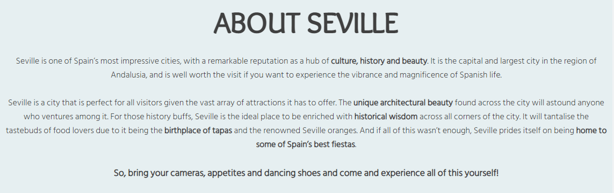

# Visit Seville
Visit Seville is a tourist information website for people interested in visiting Seville, Spain. It includes a number of recommendations for the key attractions to explore as well as some advice on the best times of year to visit.

[View the live site here](https://s-batish.github.io/visit-seville/index.html)

## User Experience
### Key information included on the site
- A brief overview of the city's highlights
- Images and key facts about each attraction
- Information about when to visit the city
- A contact us form to sign up to a monthly newsletter about Seville and to ask any further questions
### Site Owner's goals
- To provide a comprehensive and informative guide about the main tourist attractions in Seville
- To provide a brief overview of the best times of year to visit the city so that visitors can be prepared for what to expect
- To show the beauty of the city through a number of photographs of Seville
- To enable people to sign up for a monthly newsletter for more relevant and regularly updated information about the city
- To provide a space for people to ask further questions that may not have been answered through the site
### External User's goals
- I want to easily find out about the key sites to visit in Seville and to know when is best to visit based on price and climate
- I want to see what the main features of the city look like
- I want to easily contact someone to ask further questions and to be regularly updated about events in the city
## Design
### Wireframes
Balsamiq wireframes were created for mobile, tablet and desktop devices to show the structure and overall design of each page.

[Home page wireframe](docs/wireframes/home-wireframe.png)

[Things to do wireframe](docs/wireframes/things-to-do-wireframe.png)

[When to visit wireframe](docs/wireframes/when-to-visit-wireframe.png)
- Initially the 'When to visit' section of information was intended to be laid out on a separate page, which can be seen in the wireframe above. However, after a discussion with my mentor, it was decided that it looked better, and made more sense, to have this section of information on the homepage underneath the 'About Seville section' instead.

[Gallery wireframe](docs/wireframes/gallery-wireframe.png)

[Contact us wireframe](docs/wireframes/contact-wireframe.png)

### Colour scheme

[Adobe Color](https://color.adobe.com/create/color-wheel) was used to create the colour palette for the website.
### Typography
The following [Google Fonts](https://fonts.google.com/) were used for the typography for the website:
- Pacifico is used for the h1 logo
- Overlock is used for the h2 headings
- Lato is used for the h3 headings
- Hind Siliguri is used for the body text
## Features
The website is made up of six pages, four of which are accessible from the navigation menu (Home page, Things to do page, Gallery page, and Contact us page). The other two pages are a Thank you page, which is displayed once the user submits the form on the Contact us page, and a 404 page, which is displayed if a user tries to reach a non-existent page on the website.
### Common features
- Navigation bar
    - The navigation bar features at the top of each of the four main pages of the website, and it is sticky to ensure that it is always visible even when scrolling down the page.
    - It contains links to the Home, Things to do, Gallery and Contact us pages. The logo itself is also a link to the Home page.
    - The navigation bar is responsive on all devices. For mobiles and small devices, the navigation bar items are stacked in a column. But as the screen size increases, the menu items display horizontally and their font size, as well as the logo size, increase at various intervals, through the use of media queries.
    - A horizontal line displays underneath the active page that the user is on so that they can clearly see which page they are currently on. The horizontal line will also display underneath each menu item when the user hovers over it.

- Footer
    - The footer appears at the bottom of each of the four main pages and contains icons as links to social media websites that will open in a new tab. Aria labels have been used on the social media icons to ensure the footer is accessible to the visually impaired.

- Favicon
    - A favicon icon of the Spanish flag will display on every page of the website to make the website easily identifiable in the tabs header.

- 404 page
    - The 404 page has been implemented to display if a user is misdirected to a broken link. It has a 'Return to main website button' to direct the user to the home page without the need to click the back button on their browser.

### Home page features
- Hero image
    - This is a picture of one of Seville's main attractions (the Plaza de España) with cover text statement to entice users to explore the site further.
    - The image zooms in when the user clicks on the logo/Home link on the nav bar, and it was chosen to be the hero image because it is one of the most popular landmarks in Seville, so is instantly recognisable for those who may know a little about the city, and for those who know nothing about the city, it is an eye catching structure that is made more appealing through the zoom feature. Moreover, it stretches nicely across the screen on large screen sizes, while also resizing on smaller devices to ensure that it always grabs the attention of the user.
    - The cover text also increases as the screen size increases so that it is proportioned well against the image.

- About Seville section
    - This section provides a brief introduction to Seville by mentioning some of the key features of the city, which have been highlighted in bold to draw the user's attention to these aspects.
    - This section lets the user know what to expect, at a glance, from a visit to Seville.

- When to visit section
    - This section features underneath the About Seville section and is separated from that section with an image of a typical Sevillian street that is in keeping with the colour scheme.
    - This section provides clear information to the user about the best time of year to visit the city, and it is divided into smaller sections to make it easier for users to identify the best time to visit based on their needs.
    - Below this, there is a link directly to the Contact us form to make it easier for users to enquire further about when to visit.

### Things to do page features
- Things to do
    - This page provides the user with eight recommendations for things to see and do in Seville.
    - Each attraction is displayed with what it is, a photo of it, and some information below detailing why it should be visited.
    - This section is fully responsive. On small and medium sized devices the recommendations are displayed in a single column on top of each other, so that the images are clear and the screen does not look congested with information. On large to extra large devices the content is displayed in two columns and on larger than extra large devices the content is displayed in three columns. This is to ensure that the recommendations are presentable and easily digestible for the user.

Below all of the recommendations, there is a link directly to the Contact us form for users who wish to find out more in a monthly newsletter about the city.

### Gallery page features
- Gallery page
    - This page provides a fully responsive insight into the key features of Seville through photos. This gives the user a snapshot of what is to be expected upon visiting the city.
    - Media queries have been used to change the size of the photos and the number of columns that they will appear in. This is to ensure that the photos are always clear for the user no matter what screen size they are viewing them on.

### Contact us page features
- Sign up form
    - This form enables users to contact the Visit Seville team to request a free monthly newsletter about the city and/or to ask any specific questions that they still have.
    - The form includes the following fields and attributes:
        - Name (required, type=text)
        - Email (required, type=email)
        - Would you like to sign up to our monthly newsletter? Yes/No (required, type=radio)
        - Let us know if you have any specific questions below. We're always happy to help! (type=textarea)

- Thank you page
    - If the user successfully fills out the form, they will be taken to a Thank you page once they press the submit button. This page will include a 'Return to home page' button so that the user can continue browsing the website.

### Features left to implement
- The Contact us form will be updated with the technologies required to send the contact details, sign up option and questions to a database so that the user will be able to receive their newsletter and/or have their questions answered.
- Each gallery image could be clicked on to expand with a small description of what each photo is.
## Technologies
- HTML
    - The main language used throughout the website to create the structure
- CSS
    - Used to implement styling across the website
- Gitpod
    - Used to develop and edit the code
- Git
    - Used to commit and push the code
- Github
    - Used to store and deploy the code
- [Balsamiq](https://balsamiq.com/)
    - Used to create wireframes
- [Google Fonts](https://fonts.google.com/)
    - Used to import fonts
- [Font Awesome](https://fontawesome.com/icons)
    - Used icons from this website as the social media links
- [Fontjoy](https://fontjoy.com/)
    - Used to create the font pairings used on the website
- [TinyPNG](https://tinypng.com/)
    - Used to reduce the size of the images used throughout the website
- [Favicon](https://favicon.io/)
    - Used to create a favicon

## Testing
## Deployment
## Credits